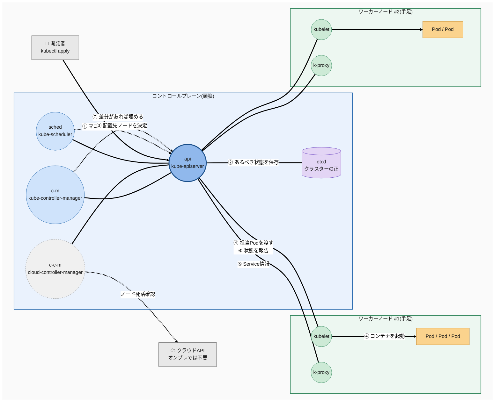
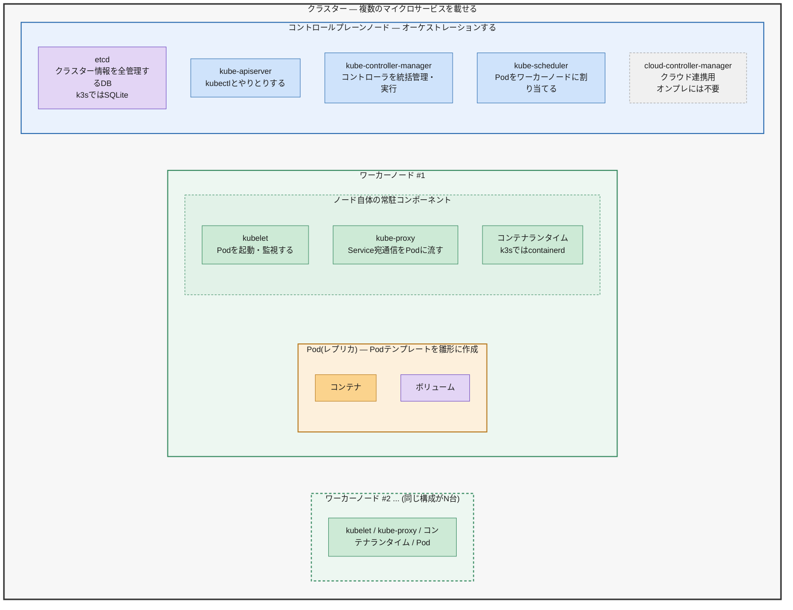

# 自分用メモ

## 用語整理

マシンの軸

- クラスター: 複数のマイクロサービスを載せる
  - コントロールプレーンノード: オーケストレーションする
    - etcd: クラスター情報を全管理するデータベース。
    - kube-apiserver: kubectlとやりとりする
    - kube-controller-manager: コントローラを統括管理・実行
    - kube-scheduler: Podをワーカーノードに割り当てる
    - cloud-controller-manager: クラウドサービスと連携に使用し、ノードが消えたらクラドAPIに問い合わせて確認するなど。オンプレには不要。
  - ワーカーノード
    - kubelet、kube-proxy、コンテナランタイム
    - Pod(レプリカ): ポッドテンプレートの雛形に基づいて作成
      - コンテナ
      - ボリューム

### 図1: どう動くか(概要)

公式図と同じ構成。kube-apiserverが中心(ハブ)で、他のコンポーネントは互いに直接喋らず必ずapiserverを経由する。

Deployment適用時の流れ:

1. `kubectl apply`でマニフェストをkube-apiserverに投げる
2. kube-apiserverが「あるべき状態」をetcdに保存する(この時点ではまだ何も動いていない)
3. kube-schedulerが配置先ノードの決まっていないPodを見つけ、空きリソースを見てノードを決める
4. 対象ノードのkubeletがapiserver経由で自分の担当Podを受け取り、コンテナランタイムでコンテナを起動する
5. kube-proxyがService宛の通信をPodに流すためのルールをノードに設定する
6. kubeletが実際の状態をapiserverに報告し続ける
7. kube-controller-managerが「あるべき状態」と「実際の状態」を比べ、差があれば埋める(Podが落ちたら作り直す、など)

---

### 図2: 入れ子構造(登場人物と、実は何が中にいるか)

図1の登場人物が実際どこに属しているか。矢印なし。枠の入れ子と色の濃さがそのまま階層の深さ。

---

オブジェクトの軸

- デプロイメント: Podのデプロイを管理。マニフェストファイルに`kind: Deployment`に対応する?
  - レプリカセット: Podの数を管理する
    - Pod
- サービス: Podをまとめて管理する。ロードバランサー的にPodを管理する。サービス単位でクラスターIPがふられる

---

## マニフェスト

- DeploymentとServiceを粗結合にわけて書くようにできている(1つのファイルに書いても良い)
  - Podはアプリの更新時に再ビルドするのでDeploymentのライフサイクルは短い
  - Serviceは割と長生きする
  - Serviceのversionセレクタを切り替えるだけでBlue/Greenデプロイできる

---

## コマンド

- applyでマニフェスト適用
- get node get podのようにgetでチェック

---

## k3s

- etcd: sqLite
- コンテナランタイムはcontainerd
- k3sに限らず、k8sはイメージビルド機能はないので事前にイメージ作成が必要
